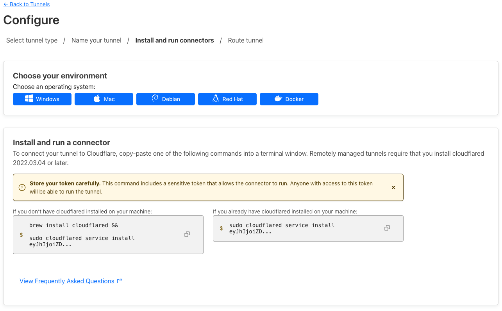
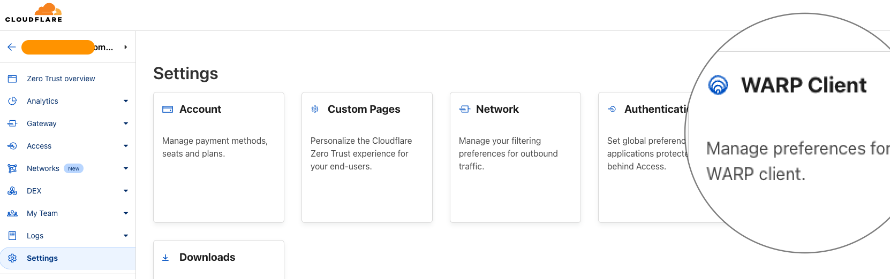
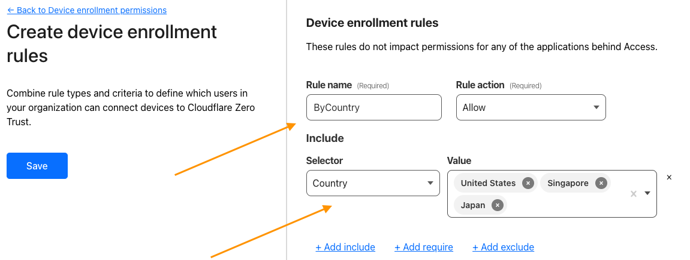
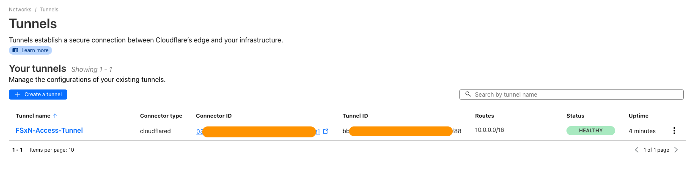
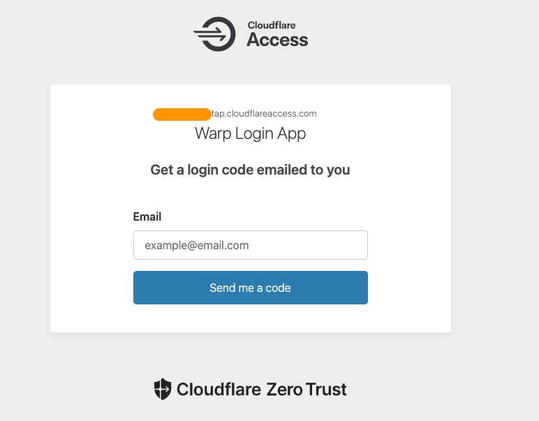

# Cloudflare Setup

This document describes the steps to configure a new cloudflare account ready for zero trust access

### Setting Up Cloudflare Zero Trust Tunnel

##### **Login to your Cloudflare account:** Navigate to Zero Trust

##### **First Time Setup:** For the first time setup create a team name which will be used later on for access from the client.

> [!IMPORTANT]
> If this is the first time you are creating the cloudflare account it will ask you for the billing information which can be set to the Free plan for non-production use.

> [!NOTE]
> This name can be updated later on if required

##### **Setup Tunnel Configuration** ([Cloudflare Docs](https://developers.cloudflare.com/cloudflare-one/connections/connect-networks/get-started/create-remote-tunnel/)) Create a Tunnel with the connector Cloudflared.

##### **Specify the Tunnel name (it needs to be unique)**

##### **Skip the connector setup/installation page**

##### **Create the Private Network which should be the CIDR range of the VPC or the subnet in AWS that should be allowed access via the tunnel**

>  [More details here](https://developers.cloudflare.com/cloudflare-one/connections/connect-networks/private-net/cloudflared/)

### API Key Setup ([Cloudflare Docs](https://developers.cloudflare.com/cloudflare-one/api-terraform/scoped-api-tokens/))

##### **Access the My Profile from the top menu**

##### **Access API Tokens and Select Create Token**

##### **Create new token by selecting Get Started under Custom Token**

##### **Add the token name, permissions and TTL (if required)**

> Permissions required are Cloudflare Tunnel - Edit and Account Settings - Read

##### **Test the token using the curl command from any device**

### WARP Device Enrollment ([Cloudflare Docs](https://developers.cloudflare.com/cloudflare-one/connections/connect-devices/warp/deployment/device-enrollment/))

##### **Create a device enrollment profile** The device enrollment profile defines various measures to control which devices can access the tunnel. For the purpose of this setup, we can create a profile that will be filtered based on the country.

##### **Edit the default profile**

##### **Include all IP and Domains in the settings** This allows access to all the IPs within the AWS VPC/Subnet

##### **Add Device Enrollment Rules**

##### **Add Rules**

##### **Specify the rules that will be used for allowing device enrollment**

##### **Validate the Tunnel status** This validation will show "Healthy" once the deployment of the terraform resources has been completed

### Client Setup ([Cloudflare Docs](https://developers.cloudflare.com/cloudflare-one/connections/connect-devices/warp/deployment/manual-deployment/))

> [!IMPORTANT]
> The connection from client to ZeroTrust can be configured prior to the deployment on tunnel on AWS
> However, once the tunnel is deployed and running, the client should be reconnected to refresh the route tables

##### **Access the WARP Client**

##### **Launch Preferences to Login to Cloudflare Zero Trust**

##### **Enter the team name created in [account setup steps](#enter-the-team-name-created-in-account-setup-steps-here)**

##### **Provide an email address which will receive the one-time pin for access**

##### **Successful login should re-launch the WARP client with the label shown as "Zero Trust"**

#### **Connect to gain access into the private network**

