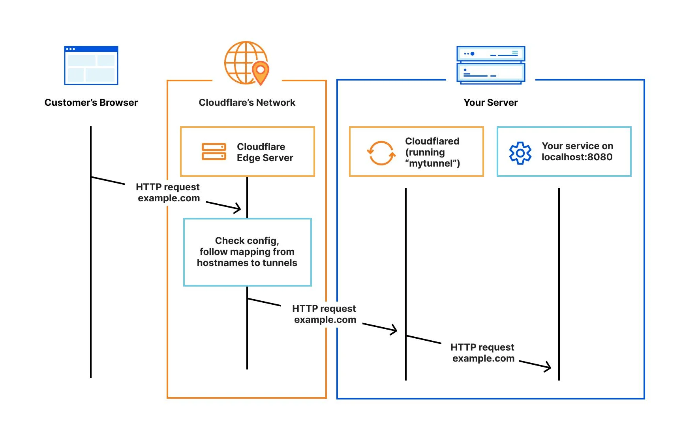
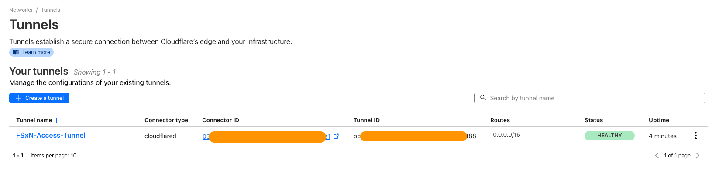

# Access Amazon FSx for NetApp ONTAP Filesystem using Zero Trust access

> The sample terraform deployment creates a Single AZ Amazon FSx for NetApp ONTAP filesystem with CloudFlare ZeroTrust tunnels.

## High Level Architecture


## Why Zero Trust?

Zero Trust is fundamentally important for security in today's highly connected digital environment for several reasons:

1. **No Implicit Trust:** The foundational principle of Zero Trust is that no user or device should be trusted by default. It doesn't matter whether the user or device is located within the network's internal perimeter or outside of it. This is a significant departure from traditional security models that typically focus on defending the perimeter while trusting anything inside.
2. **Strict Access Control:** Zero Trust involves rigorous verification for every person and device attempting to access resources on the network. This stringent control minimizes the likelihood of unauthorized access. Each request is thoroughly vetted to confirm the right credentials are presented before access is granted.
3. **Layered Defense:** By requiring verification at every step, Zero Trust effectively creates multiple layers of defense against potential cyber threats. This makes it more difficult for any malicious elements to gain access to the network. Even if one layer is breached, the intruder would still need to overcome subsequent layers.
4. **Mitigation of Insider Threats:** Zero Trust is also effective in managing insider threats. Since it doesn't automatically trust anything, even users and devices within the network have to prove their legitimacy each time they seek access to network resources.
5. **Enhanced Visibility and Control:** Zero Trust models provide increased visibility into network activity. This makes it easier to monitor who is doing what on the network, which is critical for detecting any unusual or potentially harmful activity. It also gives organizations more control over their networks.
6. **Adherence to Compliance Requirements:** In industries where compliance with specific regulations is required, Zero Trust can simplify the process. The increased visibility and control over the network that Zero Trust offers can make it easier to ensure and demonstrate compliance with various security policies and regulations.
7. **Adaptability:** In a rapidly evolving technological landscape, security solutions need to be flexible and adaptable. Zero Trust models, with their focus on verifying every access request regardless of its origin, are well-suited to handle changes and advancements in technology.

## Cloudflare Zero Trust



Setting up Cloudflare Zero Trust involves creating a secure tunnel, configuring access policies, and ensuring the secure connection is established. To do this, you first need to log into your Cloudflare account and navigate to the Zero Trust section. From there, you can create a new tunnel, enter the relevant details, and configure it to point towards your Amazon FSx for NetApp ONTAP subnet CIDR range or the whole VPC CIDR range.

In addition to setting up the tunnel, you also need to define the access policies that determine which users or groups can access your tunnel. These policies can include additional security measures, such as requiring multi-factor authentication. Once all the details have been entered and the policies set, you can save and start the tunnel. Your Cloudflare Zero Trust tunnel is now set up and ready to securely connect you to your SMB or NFS shares on your Amazon FSx for NetApp ONTAP system.

To further enhance security, you can also install the Cloudflare Warp client on your system. This allows you to connect to the tunnel directly from your system, providing an additional layer of security. The installation process involves downloading the appropriate version of the client for your operating system, installing it, and then configuring it to connect to the tunnel.

Another crucial aspect of setting up Cloudflare Zero Trust is installing it on Amazon EC2. This involves launching an Amazon EC2 instance, downloading and installing the Cloudflare Tunnel. Once the tunnel is installed, configured, and started, providing a secure connection between your EC2 instance and your Amazon FSx for NetApp ONTAP file system.

## Prerequisites

1. [Terraform prerequisites](#terraform)
2. [Cloudflare prerequisites](#cloudflare)
3. [AWS prerequisites](#aws-account-setup)

### Terraform

| Name                | Version  |
| ------------------- | -------- |
| Terraform           | >= 1.5.7 |
| AWS Provider        | >= 5.38  |
| Cloudflare Provider | >= 4.90  |

### Cloudflare

Refer to the documentation for [Cloudflare account and tunnel setup](Cloudflare-Setup.md)

### AWS Account Setup

- You must have an AWS Account with necessary permissions to create and manage resources
- Configure your AWS Credentials on the server running this Terraform module. This can be derived from several sources, which are applied in the following order:

  1. Parameters in the provider configuration
  2. Environment variables
  3. Shared credentials files
  4. Shared configuration files
  5. Container credentials
  6. Instance profile credentials and Region

  This order matches the precedence used by the [AWS CLI](https://docs.aws.amazon.com/cli/latest/userguide/cli-configure-quickstart.html#cli-configure-quickstart-precedence) and the [AWS SDKs](https://aws.amazon.com/tools/).

> [!NOTE]
> In this sample, the AWS Credentials were configured through [AWS CLI](https://aws.amazon.com/cli/), which adds them to a shared configuration file (option 4 above). Therefore, this documentation only provides guidance on setting-up the AWS credentials with shared configuration file using AWS CLI.

## Usage

#### 1. Clone the repository

In your server's terminal, navigate to the location where you wish to store this Terraform repository, and clone the repository using your preferred authentication type. In this example we are using HTTPS clone:

```shell
git clone https://github.com/varunrai/fsx-ontap-cloudflare-zerotrust-access.git
```

#### 2. Navigate to the directory

```shell
cd terraform
```

#### 3. Initialize Terraform

This directory represents a standalone Terraform module. Run the following command to initialize the module and install all dependencies:

```shell
terraform init
```

A succesfull initialization should display the following output:

```shell

Initializing the backend...
Initializing modules...

Initializing provider plugins...
- Reusing previous version of cloudflare/cloudflare from the dependency lock file
- Reusing previous version of hashicorp/http from the dependency lock file
- Reusing previous version of hashicorp/aws from the dependency lock file
- Reusing previous version of hashicorp/random from the dependency lock file
- Reusing previous version of hashicorp/local from the dependency lock file
- Using previously-installed hashicorp/local v2.1.0
- Using previously-installed cloudflare/cloudflare v4.35.0
- Using previously-installed hashicorp/http v3.4.3
- Using previously-installed hashicorp/aws v5.54.1
- Using previously-installed hashicorp/random v3.1.3

Terraform has been successfully initialized!

You may now begin working with Terraform. Try running "terraform plan" to see
any changes that are required for your infrastructure. All Terraform commands
should now work.

If you ever set or change modules or backend configuration for Terraform,
rerun this command to reinitialize your working directory. If you forget, other
commands will detect it and remind you to do so if necessary.

```

You can see that Terraform recognizes the modules required by our configuration: `hashicorp/aws`.

#### 4. Create Variables Values

- Copy or Rename the file **`terraform.sample.tfvars`** to **`terraform.tfvars`**

- Open the **`terraform.tfvars`** file in your preferred text editor. Update the values of the variables to match your preferences and save the file. This will ensure that the Terraform code deploys resources according to your specifications.

- Set the parameters in terraform.tfvars

  ##### Sample file

  ***

  ```ini
    creator_tag          = "<CreatorTag>"
    aws_location         = "<AWS Region>"
    fsxn_password        = "P@ssw0rd@123"
    ec2_iam_role         = "<EC2 IAM ROLE>"
    ec2_instance_type    = "t3.small"
    ec2_instance_keypair = "<EC2 Key Pair>"
    /* CloudFlare Variables */
    cloudflare_token       = "<Cloudflare API Token>"
    cloudflare_tunnel_name = "<Cloudflare Tunnel Name>"
  ```

> [!IMPORTANT]
> Make sure to replace the values with ones that match your **AWS and Cloudflare environment and needs.**

#### 5. Create a Terraform plan

Run the following command to create an execution plan, which lets you preview the changes that Terraform plans to make to your infrastructure:

```shell
terraform plan
```

Ensure that the proposed changes match what you expected before you apply the changes!

#### 6. Apply the Terraform plan

Run the following command to execute the Terrafom code and apply the changes proposed in the `plan` step:

```shell
terraform apply
```

#### 7. Validate Tunnel Health

> This validation will show "Healthy" once the deployment of the terraform resources has been completed


